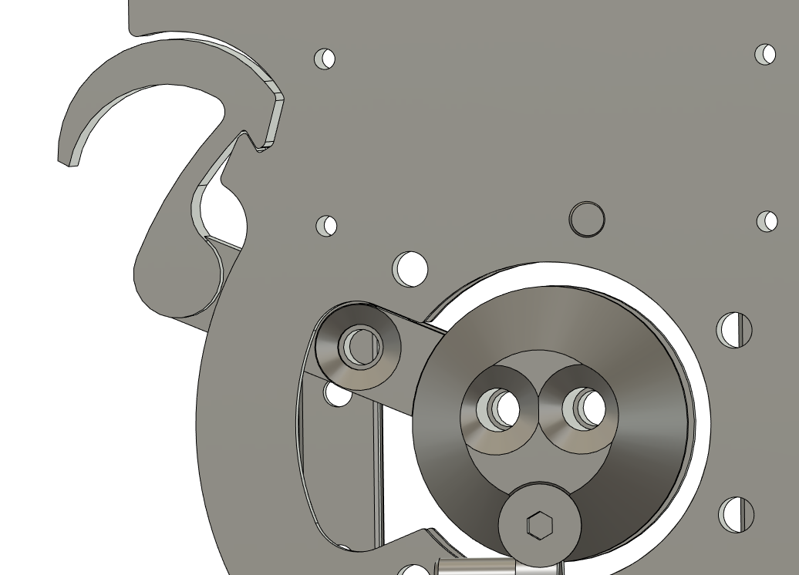
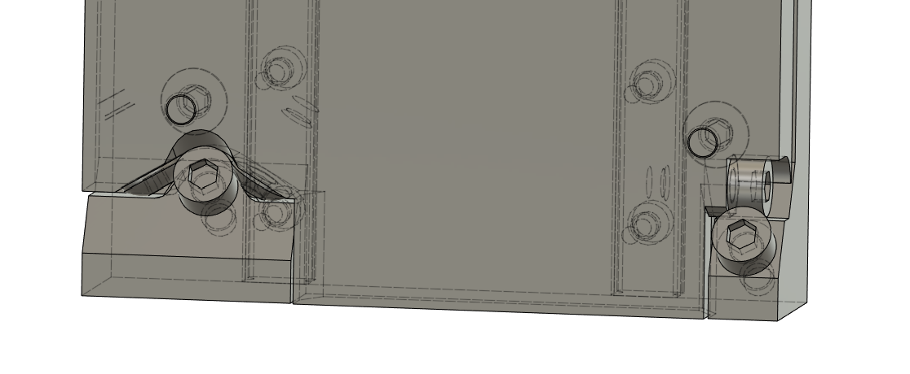
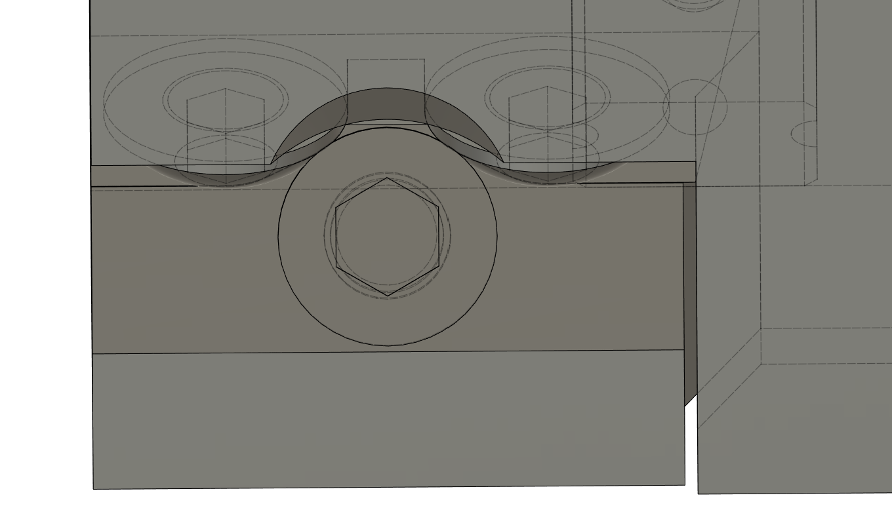
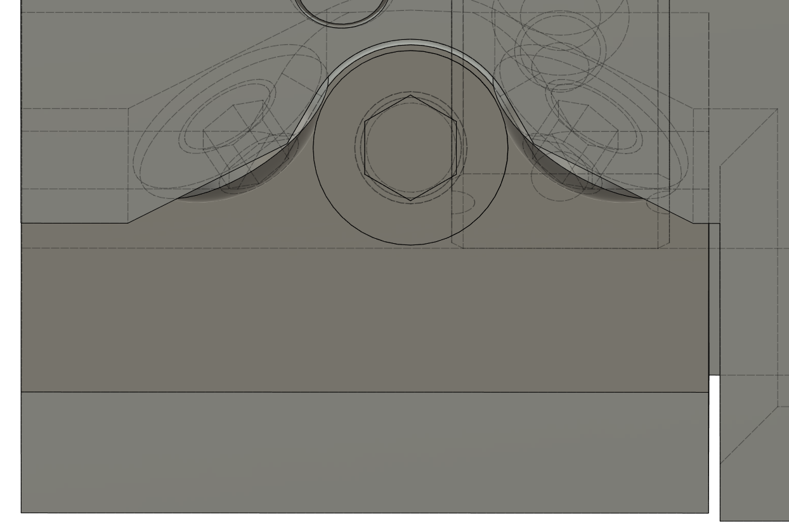
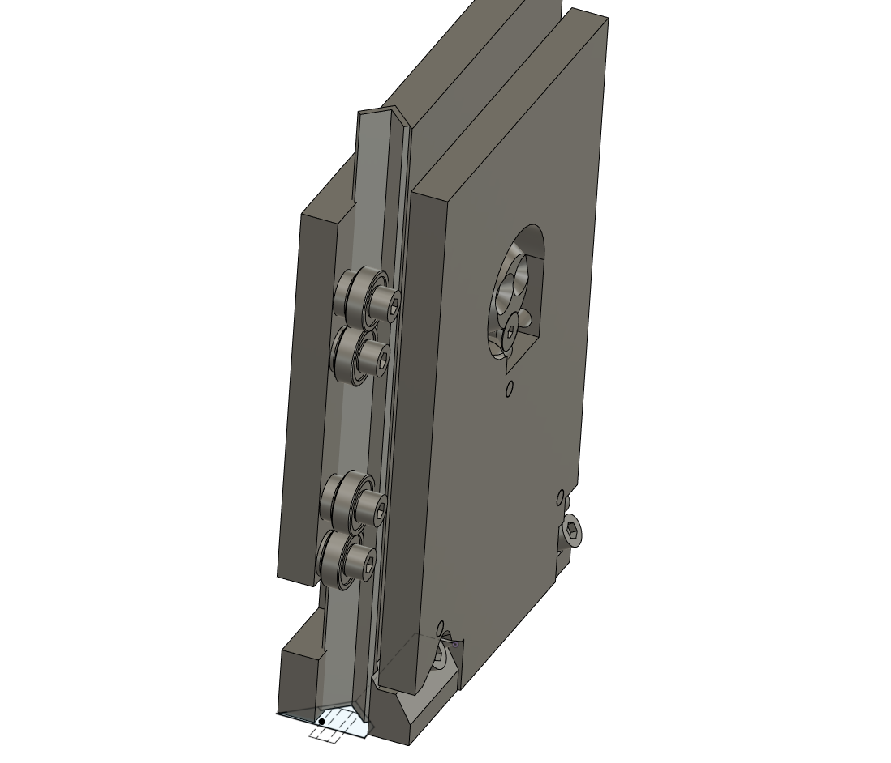
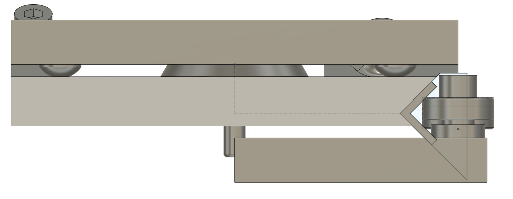

## 2022 08 07 

... there are more notes, in i.e. 2022-06? or -07?

I just want to figure sizes : sizes at the moment... 

| rail len | offsets | travel size |
| --- | --- | --- |
| 400mm X rail / bed | 50 + 42 + 107 = 199 | 201mm |
| 430mm Y rail | 100 + 2 | 328mm |
| 490mm Y bed | 

So given x, y travel sizes we have:

```
y rail size = y + 199
y bed size = y rail size 
x rail size = x + 102 
x bed size = x + 162 
```

alright then, I think I want ~ 250 x 300, this covers 8.5x11" letter and A4, it's all rough anyways, that means 

y rail, y bed = 450mm
x rail = 402mm (might as well 400mm)
x bed = 460mm 

alright alright, it'll be roughly square 

## 2022 08 20 

I had settled on a redesign of the toolchanger... I kind of think / hope that the 3rd rev is the winner, this is often the case in design anyways: 1st being hot garbage, 2nd taking the most time and refinement / teaching the most but ultimately not being quite it, then the 3rd embodying some big architectural changes that prevented the 2nd from really singing, and also the detail learnt through dev on the 2nd. Etc. So here we are.

Alright lol, clearly just mucking around today;


The labels are fun... I figure that circuits would go *up top* with a very simple SHCS-head-into-tapered-entry-cylindrical-pocket across the pogo. Will fit widths for that eventually, time being I am going to hand operate this badboy, try to get clankite up-and-running and bed probing, etc. Things to design before auto-swapping with this:

- the z-axis, 
- the spindle, 
- the bed probe circuit (or friggen breadboard something homie) 
- then the PCB workflow, engraving bits use, etc... 

## 2022 08 21 

Some adjustments... 

- tighter, also wider lower left buttons
- don't crack open at the clamp-down M5 SHCS 
- taper on the key 

IDK about the XZ, it's for sure the crux of it. I think the Z driver should be perpendicular as it is in -stretch, maybe, and the toolchanger should get "gripped-around' i.e. have little rails on left and right sides that it travels along on, squanching it back into the face of the rail... not sure exactly, maybe it floats in front, but we are quickly ~ 40mm away from the rail, it's badness. 

## 2022 08 24

`2 * c_dist_manuel + 1.57 * ( pd_reduction + pd_pinion ) + ( ( pd_reduction - pd_pinion ) ^ 2 ) / ( 4 * c_dist_manuel )` 

OK... I keep on trying to tie this off with just an hour or two of work, it really wants a day for the CAD, to be solid enough for a motion system and honest application... things still remaining:

- z axis detail design:
  - another z-drive shift: hang the idlers out "the side" of the z-drive unit, lift the upper two carriages, attach the z-drive unit in close to the x-axis rollers, stick the pulleys through a hole up there...
  - lift the lower carriage elements, get at least +25mm lift,
  - belt details, tensioners, etc... 
  - ... maybe some detail for faster printing 
  - add a limit switch ffs 
- hotplate is the z axis body, etc, still hand-switched, time being though 
- add limits on XY 
- add x-gantry height to y-carriages mount 
- add stiffness on y-carriages-to-x-gantry 
- consider moving the motors to rearward, for classy packaging... ?
- ... a spindle, a bed probe ? 

... it actually might be the pro move to get a 100mm long linear rail, one carraige each, the long carriages, then we can absolutely sneak 'em in the back of the toolchanger, bigtime, i.e. there is 100mm of clear space in the back of this new beauty. Gives I think ~ 25mm of clearance on either side, which is good for most activities. Then squanch the carriages into a nice pocket in the x carriage, and we're in bigtime low-profile business, which will bring me some joy. 

https://www.amazon.com/100mm-Miniature-Bearing-Linear-Motion/dp/B07MR1S43Z/ 

That should come on Tuesday the 30th! And a print city! 

## 2022 08 30 

Well look at us, back here on time. I think I'm up to the Z axis. 

aye, alright, I've to head into lab now... but, done with the z, need limits all over the place and that toolplate adjustment, I might get back to it this evening but the aft. is for reading... 

- toolplate adjustments... bhcs angulars 
  - and lock this lever somehow, right ? servo implement? idk 
- left / right y situations 
- limits, limits, limits
  - motors back, before this ? 
- spindle coupling & 6-posn controller ? 

Doing limits now... then I *should* have some closure-lever-retainer, though *again* tempting to stick the servo in here, that'd solve both problems; having manual-operation available (?) is nice ? Indeed, I am a full hotplate-circuit away from this being auto, that's ~ a few days (at least) of design, fab, integration. 

OK, lol, I made this little clip... it's a crumpus;



Then I want... last touches around XY: limits, maybe moving the motors back (?)...

OK,

- adjust YL...
- motors -> rear (?) 
- front pulley thing (?) 
- z motor gets the z limit
- one rear motor gets the home-to-rear, 
- one gets the home-to-left
- both use halt-broadcasts to run the limit cycle, limit system becomes graph configd, lol 

I think I need an idler map to do this properly, the corexy stuff. 

I think I can actually stack the rear two idlers, that'd be ideal. I'm going to work backwards... from front idler to rear motor... will probably tension up front. 

## 2022 08 31 

I've decided I think on belt geometry, so I need to figure how I'm going to tension things and mount up to the Y rails / bed. I had a thought much earlier about using the 3DP parts to pin the rails to the bed, and it might still be the trick... wanting also to leave one side float-ey. 

I think in the end, fastening extrusion to the bed w/ holes in the bed & M5 SHCS, then fastening elsewise to the extrusion is the most sensible: otherwise we are adding out-system fasteners i.e. wood screws etc. It's something of a shame, the bed being wonderfully stiff and available. 

... might have to add a 40mm M5 FHCS for idler mounting stuff... 

Adding limits on XY now, sheesh... 

Before sending to fab, I want to wash the CAD folder also, it's a mess in here. 

The X limit is trickier; it has to be oriented such that X can escape in Y... this next, then I think I'm done (?) in time for my planned 2pm-to-fab, not bad. 

OK I have limits, I think. Now this last adjustment on the tc plate, then I'm out to fab? 



I believe that's going to be a lot better, my contact angles were ~ 20* center-to-side, now more like 45*... which would do more side-to-side work. Here's a comparison for posterity:




OK I'll print all of this, then next time we party it's going to be assembly, revisions (?) and controllers. 

- make fab 
- import new
- delete old... 

## 2022 09 01 

Sneaky assembly tonight. 

- the nose has ~ ? length M5 FHCS... should be 20, add 20 to set, more thread purchase 
- dial off ~ 0.15mm of "preload" at the toolchanger, preferrably on the tool side (!) of the CAD
- you *will need* assembly-order video for the XZ situation 
- remember to clean the cad up, yeah?
- M5x15 FHCS are prominent, not M5x14... 
- holes in the X face for Z linear rail bolt tightening 
- z drive thing... goes in w/ the only FHCS 15mm, erp, is that correct? 
- the z carriages could use, like, tapers ? for the install 
- overall, z real tough. sticky, I think just because of these missing tapers ? 
  - could do a z-roller printed in the side of the hotplate itself... simple groove, consider it, should be possible somehow, maybe there's a grooved part ?? 
  - can also just cut-out some of the hotplate 
- pulleys should get +1mm gap, for the rear stack's clearance: they're rubbing 
- motors don't move back bc shcs 
- you went *down* on the right side idler, not *up* - tf ? 
- idlers need much more tracking authority... consider using pulleys everywhere & 5mm SHCS shafts, or just get beefy with the print, 
- you should have parameters for M5 taps, thrus, chamfers, ibid M3s, and idler OD / inside teeth OD, outside teeth OD, flange OD ... 
- some screw-to-adjust-tension would be dreamy... esp. considering the balance. 
- all told this is probably one focussed day of CAD, maybe less, maybe the afternoon is + the spindle... 

oof, also can't even get the belts pinched on to the X carriage when this gd z-assembly is on, so I'm going to go looking briefly for what would be the life-saving z-crease part, it's probably just like, mini extrusion, or some channel. 

Ah yeah it's GD [this mfer](https://www.mcmaster.com/4630T117/) slipped in the sides of the toolchanger... there is also HFSQN4-1070, sneakier. 

GD, the cycles on this mfer. I can actually avoid them in this instance by just carving out some side-access for those belt clamps, then I can get on with controllers, front-end, etc. I'll do that for now. 

## 2022 09 05 

I've had handfuls of new ideas and I think I've decided that, while I'll probably leave this baby intact to dev the controller, I'll try to make the push through today for a kind of once-over on the device.

- starting w/ idler-improvement, and spec setting for belt heights-from-rails, idler diameters...
- tilted-rollers... dimension spec for cleaner drawings elsewhere, etc ? 
- clean for a new 'XZ' assembly, work out printed-in-place canti situations, etc 
  - this is the risky bit / why we leave the oldie together 
- split toolchanger and tool-body CAD? tool-body CAD should be easily communicable... 
- the z, the z, it's coupled into the toolchanger lever, etc etc, yikes 

OK, working through a list... 

I think this exercise was largely prompted by wanting to work out the XZ axis, but IDK if I can actually kick it as I'd hoped I would have... the trouble sort of mostly being that the XY belts arrive at the X carriage right around the same spot as the Z rollers want to. Then I would just be cycling back to making some QOL improvements / assemble-ability fixes. 

Yeah, the low-BOM tight z-axis is too tricky, maybe I'll prototype some new architectures later but for the time being I should carry on... 

Though I'm maybe dispairing too early... I'll give something a little go, see how it feels... 

And then I might split this day: half in this CAD, then to lab to send prints, afternoon setting up a controller (?) or designing the first tool... 

Year, this could maybe work? 




But I am going to leave off and get back to the other stuff: assembly-order issues, print-time tightening, screw annealing. Design needs to get done, this path is leading me down a few extra hours that are not available... will see if I can challenge someone else to make it work as well. 

The downside to this z axis is mostly that we can't take the Z off without taking the X axis off as well... that'll just be a welp. 

Alright, details even are enough for a day. I need still to work out the z body... 

Aye FFS, I think I'm nearly through it again?

Yeah... 830 then, might be, checking notes (?) then I'm into layout, printing, and a trip to the lab? 

### Notes Notes Notes 

OK, AFAIK I am through with this, again, now I need to check-check and then get plates onto printers... or, realistically, could do it tomorrow at lab (?) TBD. 

Checked the notes, and I believe I've done all the diffing. So, my week's goal is to wake up the controller for it / incl. XY transforms (maybe can do all ahead of the machine (?) - and stick a spindle on it, right? Whatever, I'll build this up, get it to home and move around, then see what the heart desires: might be toolchanger circuit, it might be fixed point motion, or touch probe circuits and PCB workflows, nobody knows. 

## 2022 09 08

I got one of these assembled today, now doing limits, controllers, etc.

I think probably one large-ish delta would be adding limit switch outputs on motor firmwares, and anyways getting those working w/ these powered switches, so that we can home the corexy. Also ofc the corexy transform, which afaik is simple (?). 

## 2022 09 14 

I'm spinning out CAD today, it seems like it would be worthwhile to also get the tool-plate dims... static? I.E. release a "version" of it - and make sure not to change it. 

The idler is kind of tough - some of the previous failed, at the top... understandably, the belt misalignment pulled 'em up and loaded the flanges. It's a thickness issue... really we want walls at ~ 2.5mm thick, which would carry an update through just about everywhere. I had it dialled for two-lines at 0.4mm nozzle... I'm going to just move right up to 2mm wall thickness for these, make 'em skookum, and will carry the adjustments through, it's a last chance to fux with these anyways. 

OK yikes, surprise hardware task:

- flow changes through z structure, (done)
- idler changes (out and update) (done)
- y carriage changes (done) 
- motor changes (shimmy and update) 
- check all flange clearances, everywhere, forever, and embiggen 
- you're done, ship to clank.tools 

Nearly done, ffs, this is an errand.

- just get plates out, enough to send to folks, you're in controller town still 

## 2022 09 20 

I'm going to setup some new plates to print today, and just adapt the tool changer to future-proof for circuits. 

My pogo pins have initial contact at 0.236" (6mm) from the pcb surface, and have 0.055" (1.4mm) of stroke, so I want the tool to be contacting at 5mm from the PCB surface... PCBs being 1.6mm thick, and I want 5mm final spacing (for 1mm of throw-s worth of pressure) I want the *bottom* of the toolchanger pcb to be... 5 + 1.6 * 2 = 8.2mm from the *back* of the tool. 

The existing gap is (allegedly) 2.75mm, so I need to push a 5.45 (5.5) millimeter pocket into the existing face. 

### "Deploying"

- should version the main assembly to a Fusion Version... that's "release" - ? and stash those are .f3z's ... 

## Kritical Dims

```
M5 "Tap" Hole           4.4 
M5 Thru Hole            5.5
M5 "Tap" Chamfer        0.5 
M5 FHCS Thru Chamfer    2.5 

Idler Physical OD       20.00
Idler PD Inside Teeth   22.10 
Idler PD Outside Teeth  20.70
Idler Total Height      12.5
Idler Clearance ID      14.5 

X Rail Face to Belt PL  6

Y Rail Top to Belt 1 CL 18.5
Y Rail Top to Belt 2 CL 32.5

Rail Edge to Roller CL  6.75
Roller Mount Hole Space 41
Roller Width            11.5
Roller Bearing Width    16
Roller Length           82
Roller Depth            20.5 (not centered!) 
```

### CAD Delta Desires

- could rm M5x10 SHCS throughout and replace with FHCS, M5x14 SHCS, right? 
- check / sweep for a hardware BOM and tighten up overall if it seems possible 
- most important though is not getting bogged in the details, i.e. make a toolchanger circuit, make the head-board circuit, make the usb-bus python code, etc 

### Hardware Set

- check check ? 

### Docu-Notes

- the "extract BOM" fusion default script actually... is good enough for this application... 

### Dev Notes

- if we use long-throw limits (i.e. the trip-light type) we can whip into 'em at higher accels, shorten the homing cycle bigly 
- the final z-axis will likely use more bearing rollers and i.e. [this mfer](https://www.mcmaster.com/4630T117/) slipped in the sides of the toolchanger... there is also HFSQN4-1070, sneakier... will proceed with linear slides for now, I want to get up to controls, tools, etc. 

## Notes Notes

- it'd be wise / interesting to do the hertz contact model for the bearing-on-alu, and see under-what-loads we surpass a denting force... that would tell us if i.e. the MaaS machine needs to have substantially larger bearings, or, if this whole thing is a bad-bad idea: also the same model for delrin v-rollers, to compare 

### Hotplate Dev Notes

- put pogo above the rotary-key, use SHCS into cylindrical pockets w/ tapers for pogo coarse alignment; be simple... 

### Assy Notes

- it's possible to put one of these roller units together improperly, shouldn't be 
- try these roller units w/ just shoulder bolts for the MaaS Machine ? and triplet-style roller units... that can tip / shift for kinematics 
- assembly should just bolt straight onto some sheet, no back bar... opens some free space as well 
- base plate should be square if possible
- rather than making any holes / etc in plate, try 3DP corner bits ? then we are just rip-rip on the saw & blip blip into the sheet 
- would like to have the motors in the rear... seems possible (?) might be adding some rollers though... idk 
- lots of torsion-stiffness-loss thru these wimpy little y-carriage-to-x-beam-back-supports, they want that idler-stiffening top appendage... as do, I imagine, the rear studs 
- ya boi needs a Z axis, der... tempting to try clank hotplate, also tempting to either modify for low-BOM-count hotplate design *or* make a cut-er tool interface, but gd, do one, my guy 